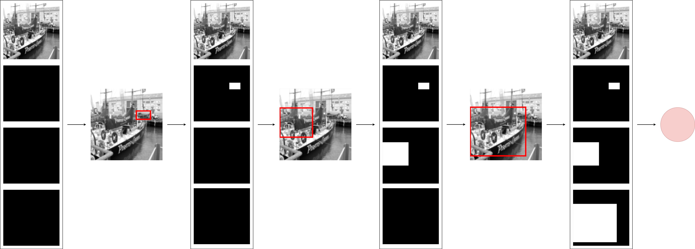

# MIOD: Mask-Iterative Object Detection 

**What is it:** MIOD is a novel autoregressive architecture for object detection that avoids reliance on recurrent networks or transformer architectures. It emulates human-like sequential object recognition through a lightweight, architecture-agnostic convolutional network making it particularly useful for resource-constrained embedded applications.



**Iterative Mask-Guided Detection**: This is the heart of our approach. MIOD processes an image along with three masks as its additional channels. These masks, have the same dimensions as the image and are set to `-1` at the beginning.
When a prediction is made, the network updates the appropriate mask by marking the corresponding area of the bounding box with `1`. Mask is selected by calculating the area the bounding box takes and looking at the thresholds between masks. These are for small, medium, and large objects. The image and updated masks are then re-input into the model for subsequent predictions.

## Installation

1. Install the environment

```bash
conda env create -f environment.yaml
conda activate miod
```

2. Download appropriate dataset
If you want to use COCO dataset, then:
```bash
python get_coco.py
```
If you want to use Pascal dataset, then:
```bash
python get_pascal.py
```

3. Ready to experiment with model
## Train

To train the model with COCO dataset you just need to:
```bash
python train.py
```

If you want to train the model with PASCAL dataset, then you need to change from `COCODataset` to `PascalDataset` in `get_dataloader` function inside `dataloader.py`
## Evaluation

To check the model mAP performance, set the `torch.load(PATH)` inside `eval.py` to your trained model and then run:
```bash
python eval.py
```
## Performance

COCO

| Model | mAP(0.5) | mAP(0.5:0.95) | Pred Time (ms) | FPS |
|:------|:--------:|:-------------:|:--------------:|:---:|
| MIOD (MobileNetv4) |   23.08  |     9.44   |   5.01   |     200     |
| MIOD (Resnet) |   21.43  |     7.93    |   5.11  |     196     |
| MIOD (EfficientNetv2) |   11.95  |     3.82   |   15.84  |     63     |

## Demo

Here are example images of MIOD performance on COCO dataset


## Contributing
Contributions are welcome! Please follow these steps to contribute:
1. Fork the repository.
2. Create a new branch:
```bash
git checkout -b feature-branch
```
3. Make your changes and commit them:
```bash
git commit -m "Add a feature"
```
4. Push to the branch:
```bash
git push origin feature-branch
```
5. Create a pull request.

## License
MIOD is released under the Apache 2.0 license. Please see the [LICENSE](LICENSE) file for more information.
